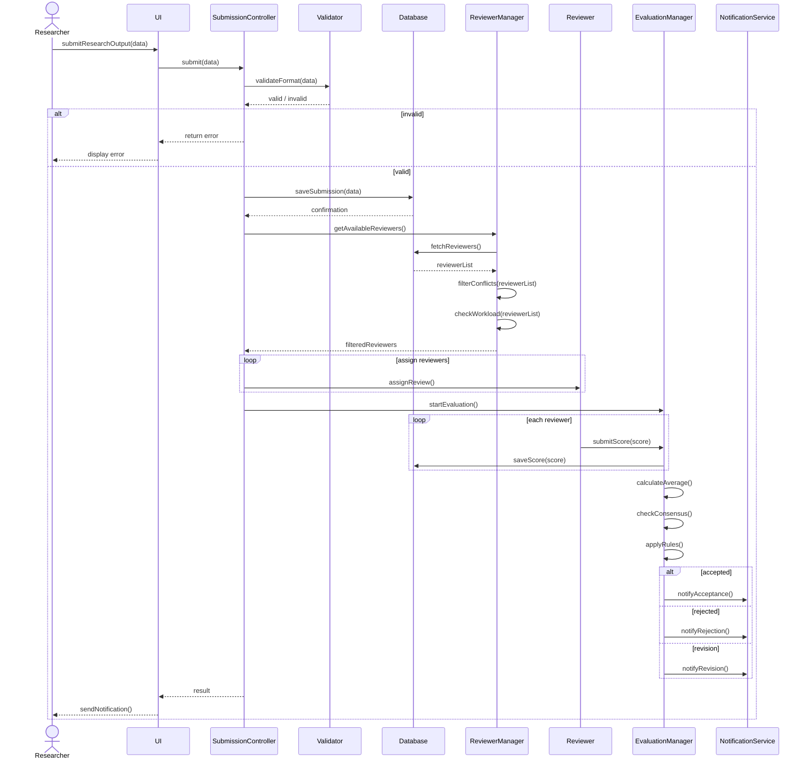
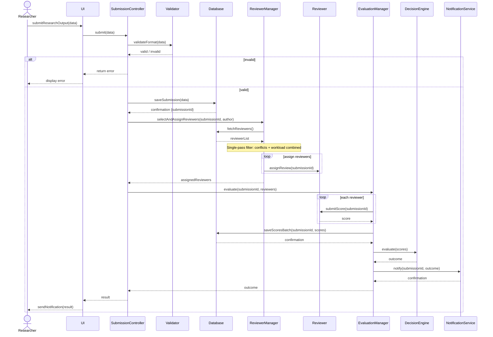
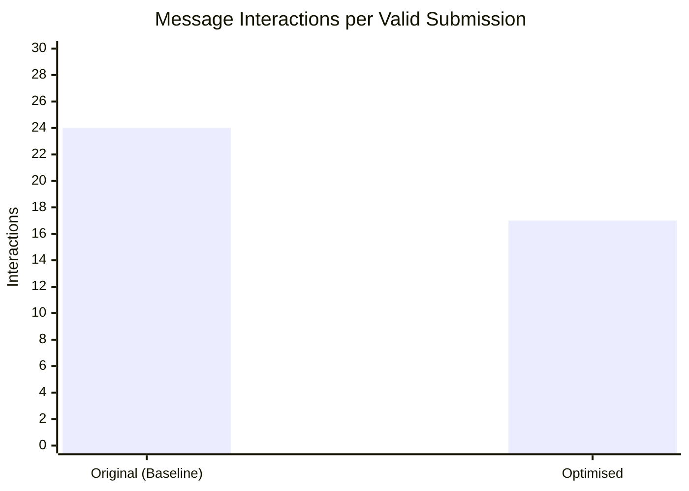
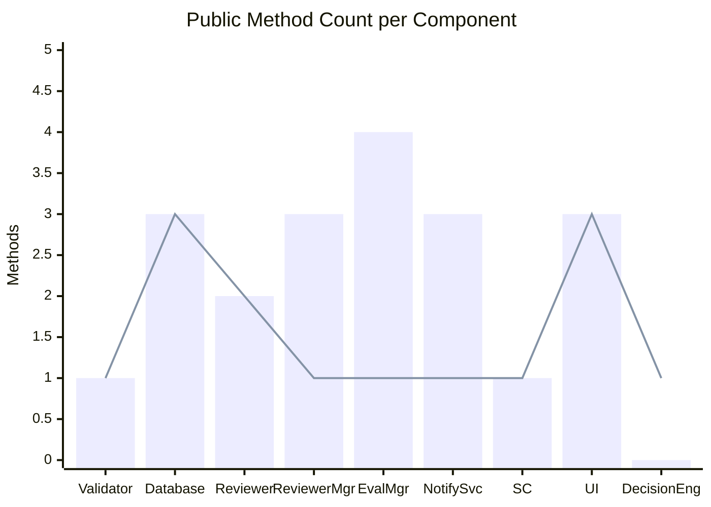
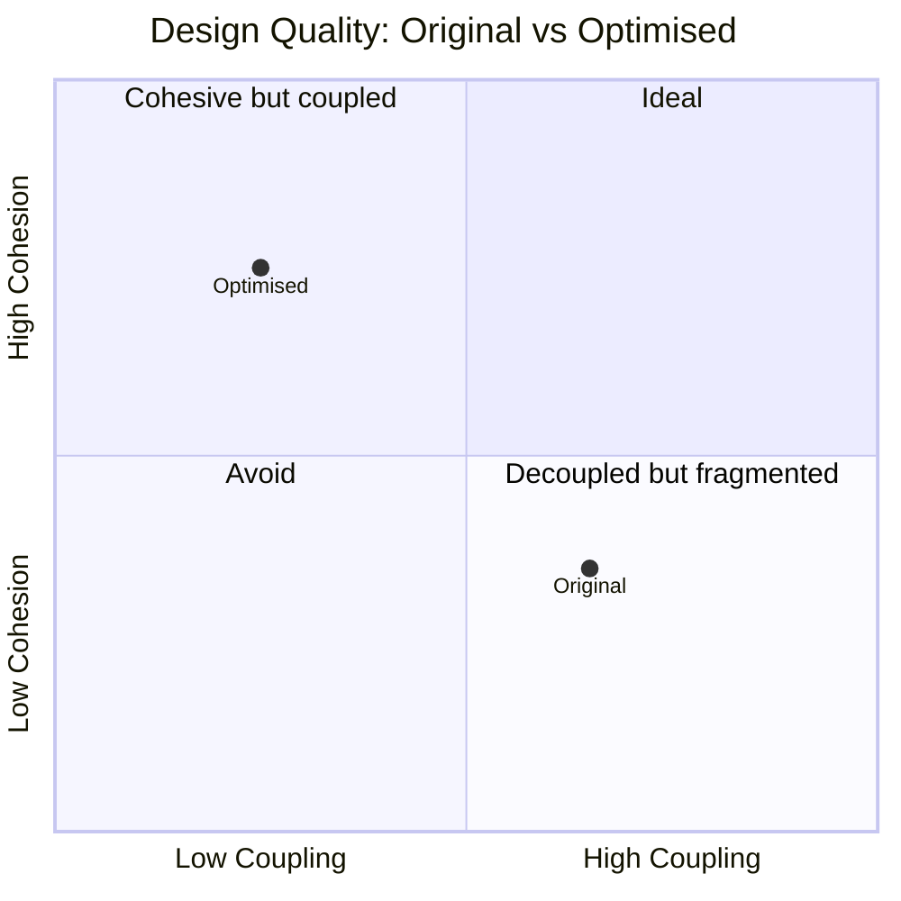

# COS 730 – Assignment 2
# From Behavioural Models to Optimised Implementation

> **Source code:** See the `Original/` and `Optimised/` folders in this repository.  
> Run original demo: `python -m Original.main`  
> Run optimised demo: `python -m Optimised.main`  
> Run benchmark: `python benchmark.py`

---

## Table of Contents

1. [Task 1 – Baseline Implementation](#task-1--baseline-implementation)
2. [Task 2 – Design Analysis](#task-2--design-analysis)
3. [Task 3 – Decision Modelling Using a Decision Table](#task-3--decision-modelling-using-a-decision-table)
4. [Task 4 – Sequence Diagram Optimisation](#task-4--sequence-diagram-optimisation)
5. [Task 5 – Optimised Implementation](#task-5--optimised-implementation)
6. [Task 6 – Empirical Evaluation and Comparison](#task-6--empirical-evaluation-and-comparison)

---

## Task 1 – Baseline Implementation

### 1.1 System Overview

The **Intelligent Submission and Review System** models the end-to-end workflow by which a researcher submits a research artefact, the submission is validated, reviewers are assigned, peer evaluation is conducted, and a final decision is communicated back to the researcher.

The implementation language chosen is **Python 3.12**, using a fully object-oriented design. Each lifeline in the provided sequence diagram maps directly to a Python class in the `Original/` package. The implementation is faithful to the diagram: all interactions, all message calls, and all control constructs (ALT, LOOP) are preserved **without optimisation**.

### 1.2 Component Mapping

| Sequence Diagram Lifeline | Python Class           | File                                     |
|---------------------------|------------------------|------------------------------------------|
| UI                        | `UI`                   | `Original/ui.py`                         |
| SubmissionController      | `SubmissionController` | `Original/submission_controller.py`      |
| Validator                 | `Validator`            | `Original/validator.py`                  |
| Database                  | `Database`             | `Original/database.py`                   |
| ReviewerManager           | `ReviewerManager`      | `Original/reviewer_manager.py`           |
| Reviewer                  | `Reviewer`             | `Original/reviewer.py`                   |
| EvaluationManager         | `EvaluationManager`    | `Original/evaluation_manager.py`         |
| NotificationService       | `NotificationService`  | `Original/notification_service.py`       |

A shared `CallTracker` instrumentation class (`Original/metrics.py`) decorates each public method to record call counts and execution times for empirical evaluation.

### 1.3 Baseline Sequence Diagram



### 1.4 Message Trace (Baseline)

| Step | Message                              | From                    | To                       |
|------|--------------------------------------|-------------------------|--------------------------|
| 1    | `submitResearchOutput(data)`         | Researcher              | `UI`                     |
| 2    | `submit(data)`                       | `UI`                    | `SubmissionController`   |
| 3    | `validateFormat(data)`               | `SubmissionController`  | `Validator`              |
| 4    | `valid/invalid` (return)             | `Validator`             | `SubmissionController`   |
| 5    | ALT [invalid]: `return error`        | `SubmissionController`  | `UI`                     |
| 6    | `saveSubmission(data)`               | `SubmissionController`  | `Database`               |
| 7    | `confirmation` (return)              | `Database`              | `SubmissionController`   |
| 8    | `getAvailableReviewers()`            | `SubmissionController`  | `ReviewerManager`        |
| 9    | `fetchReviewers()`                   | `ReviewerManager`       | `Database`               |
| 10   | `reviewerList` (return)              | `Database`              | `ReviewerManager`        |
| 11   | `filterConflicts(reviewerList)`      | `ReviewerManager`       | `ReviewerManager` (self) |
| 12   | `checkWorkload(reviewerList)`        | `ReviewerManager`       | `ReviewerManager` (self) |
| 13   | `filteredReviewers` (return)         | `ReviewerManager`       | `SubmissionController`   |
| 14   | LOOP [assign reviewers]: `assignReview()` | `SubmissionController` | `Reviewer`          |
| 15   | `startEvaluation()`                  | `SubmissionController`  | `EvaluationManager`      |
| 16   | LOOP [each reviewer]: `submitScore(score)` | `Reviewer`        | `EvaluationManager`      |
| 17   | `saveScore(score)` (in loop)         | `EvaluationManager`     | `Database`               |
| 18   | `calculateAverage()`                 | `EvaluationManager`     | `EvaluationManager` (self)|
| 19   | `checkConsensus()`                   | `EvaluationManager`     | `EvaluationManager` (self)|
| 20   | `applyRules(average, consensus)`     | `EvaluationManager`     | `EvaluationManager` (self)|
| 21   | ALT [accepted]: `notifyAcceptance()` | `EvaluationManager`     | `NotificationService`    |
| 22   | ALT [rejected]: `notifyRejection()`  | `EvaluationManager`     | `NotificationService`    |
| 23   | ALT [revision]: `notifyRevision()`   | `EvaluationManager`     | `NotificationService`    |
| 24   | `sendNotification()`                 | `UI`                    | Researcher               |

### 1.5 Baseline System Output

Running `python -m Original.main` from the project root produces:

```
[1] Valid submission:
{
  "status": "success",
  "submission_id": "SUB0001",
  "outcome": "accepted"
}

[2] Invalid submission (missing content and author):
{
  "status": "error",
  "message": "Invalid submission format"
}

Total method calls (both runs): 29
```

For a **single valid submission**, **24 method calls** are made, exactly matching the sequence diagram (see Section 6 for the full call breakdown).

---

## Task 2 – Design Analysis

### 2.1 Identified Design Issues

The baseline design, while functionally correct, contains several significant inefficiencies. Each issue is identified, related to a GRASP principle, and supported by evidence from the sequence diagram.

---

#### Issue 1: Redundant Filtering Calls in ReviewerManager

**Location:** `ReviewerManager.getAvailableReviewers()`  
**Evidence:** The sequence diagram shows two separate self-referential calls — `filterConflicts(reviewerList)` followed by `checkWorkload(reviewerList)` — each iterating over the full reviewer list.

**Problem:** Both methods perform list comprehensions over the same data. This is two sequential O(n) passes where one would suffice. The separation adds two extra message interactions to the sequence diagram without adding semantic value.

**GRASP Violation — High Cohesion:** The two filter operations are closely related and naturally belong together. Separating them into distinct tracked calls means the method performs too many fine-grained steps.

**GRASP Violation — Information Expert:** `ReviewerManager` holds all information needed to perform eligibility checking in one pass. Splitting this into two explicit calls forces the caller to coordinate two internally redundant steps.

---

#### Issue 2: SubmissionController Controls the Reviewer Assignment Loop

**Location:** `SubmissionController.submit()`  
**Evidence:** The LOOP fragment `[assign reviewers]` shows `SubmissionController` iterating and calling `assignReview()` on each `Reviewer` object individually.

**Problem:** `SubmissionController` instantiates `Reviewer` objects from raw dictionary data, controls the iteration count, and calls `assignReview()` on each — creating tight coupling between `SubmissionController` and the `Reviewer` class.

**GRASP Violation — Low Coupling:** `SubmissionController` directly depends on `Reviewer` (5 total dependencies) when it should only depend on `ReviewerManager` and trust it to return ready-to-use instances.

**GRASP Violation — Creator:** `SubmissionController` creates `Reviewer` objects but neither contains, records, aggregates, nor closely uses `Reviewer` data. `ReviewerManager`, which fetches and filters reviewer data, is the natural creator.

---

#### Issue 3: Fragmented Evaluation Logic (calculateAverage / checkConsensus / applyRules)

**Location:** `EvaluationManager.startEvaluation()`  
**Evidence:** After the scoring loop the sequence diagram shows three sequential self-calls: `calculateAverage()`, `checkConsensus()`, `applyRules()`, each with its own arrow and return.

**Problem:** These three operations are logically one computation: _"Given a set of scores, what is the outcome?"_ Exposing them as three separately invocable methods adds 3 unnecessary interactions, permits out-of-order calls, and spreads the decision logic without a clear single decision point.

**GRASP Violation — High Cohesion:** The three methods form one conceptual operation, share state (`self._scores`), and are always called together in sequence. Separating them artificially lowers cohesion.

**Behavioural Modelling Quality:** The decision logic is **implicit** — scattered across three method bodies rather than being explicitly modelled as a decision structure.

---

#### Issue 4: Three Separate Notification Methods

**Location:** `EvaluationManager.startEvaluation()` → `NotificationService`  
**Evidence:** The ALT block shows three separate branches calling `notifyAcceptance()`, `notifyRejection()`, and `notifyRevision()`.

**Problem:** The three methods differ only in their message string. Adding a new outcome (e.g., `"withdrawn"`) requires a new method _and_ updating every call site.

**GRASP Violation — Protected Variations:** The system is not protected against variations in outcomes. New outcomes require structural changes rather than data-driven changes.

**GRASP Violation — Low Coupling:** `EvaluationManager` must know the names of three different methods. A single `notify(outcome)` interface would decouple it from the specifics of how notification is performed.

---

#### Issue 5: Database Called N Times Inside the Evaluation Loop

**Location:** `EvaluationManager.startEvaluation()` — `Database.saveScore()` called inside the LOOP  
**Evidence:** The LOOP fragment `[each reviewer]` shows `saveScore(score)` called once per reviewer iteration.

**Problem:** With N reviewers this is N database round-trips for one logical atomic operation. The baseline design makes the number of DB calls proportional to the number of reviewers, which is costly in any real system (network latency, transaction overhead, connection pool pressure).

**GRASP Violation — High Cohesion:** Saving all scores is one logical persistence task, not N independent tasks.

---

### 2.2 Summary of Issues

| # | Issue                             | GRASP Principle Violated           | Methods Affected                                          |
|---|-----------------------------------|------------------------------------|-----------------------------------------------------------|
| 1 | Redundant reviewer filter passes  | High Cohesion, Information Expert  | `filterConflicts`, `checkWorkload`                        |
| 2 | Assignment loop in controller     | Low Coupling, Creator              | `SubmissionController.submit`, `Reviewer.assignReview`    |
| 3 | Fragmented evaluation logic       | High Cohesion                      | `calculateAverage`, `checkConsensus`, `applyRules`        |
| 4 | Three notification methods        | Protected Variations, Low Coupling | `notifyAcceptance`, `notifyRejection`, `notifyRevision`   |
| 5 | Per-reviewer DB calls in loop     | High Cohesion                      | `Database.saveScore` (called N times)                     |

---

## Task 3 – Decision Modelling Using a Decision Table

### 3.1 Decision Points Extracted from the System

The baseline sequence diagram contains three locations where conditional logic determines flow:

1. **Submission Validation** — ALT block after `validateFormat`
2. **Reviewer Eligibility** — implicit within `filterConflicts` + `checkWorkload`
3. **Submission Outcome** — ALT block after `applyRules`

### 3.2 Decision Table 1 – Submission Validation

| Rule | All required fields present and non-empty | Action                         |
|------|-------------------------------------------|--------------------------------|
| R1   | No                                        | Return error to researcher     |
| R2   | Yes                                       | Proceed to submission pipeline |

**Required fields:** `title`, `content`, `author`.

### 3.3 Decision Table 2 – Reviewer Eligibility

This table replaces the two separate filtering methods (`filterConflicts` + `checkWorkload`) with an explicit combined eligibility rule.

| Rule | C1: Author in reviewer's conflict list | C2: Reviewer workload > MAX (4) | Eligible |
|------|----------------------------------------|---------------------------------|----------|
| R1   | Yes                                    | —                               | No       |
| R2   | No                                     | Yes                             | No       |
| R3   | No                                     | No                              | Yes      |

**Priority:** C1 takes absolute precedence — a reviewer with a conflict is ineligible regardless of workload. C2 is only evaluated when C1 is false. The baseline code was functionally equivalent but did not make this priority ordering explicit.

### 3.4 Decision Table 3 – Submission Outcome

This is the primary decision table, replacing `calculateAverage()` / `checkConsensus()` / `applyRules()`.

**Conditions:**
- **C1:** Average score >= 7.0 (accept threshold)
- **C2:** Average score >= 5.0 (revision threshold) — note: C1 = Y implies C2 = Y
- **C3:** Consensus achieved — all scores deviate <= 2.0 from the mean

**Actions:** A1 = `"accepted"`, A2 = `"revision"`, A3 = `"rejected"`

| Rule | C1: Avg >= 7.0 | C2: Avg >= 5.0 | C3: Consensus | Action            |
|------|----------------|----------------|---------------|-------------------|
| R1   | Y              | Y              | Y             | **A1: accepted**  |
| R2   | Y              | Y              | N             | **A2: revision**  |
| R3   | N              | Y              | Y             | **A2: revision**  |
| R4   | N              | Y              | N             | **A2: revision**  |
| R5   | N              | N              | —             | **A3: rejected**  |

**Rule explanations:**
- **R1:** High score + consensus = accepted. Both must be satisfied for acceptance.
- **R2:** High score but no consensus = revision. Reviewers disagree significantly; the work needs clarification.
- **R3 + R4:** Moderate score (5–7) = always revision, regardless of consensus. Work shows promise but is not ready.
- **R5:** Low score (< 5) = rejected. Consensus is irrelevant when quality threshold is not met.

**Completeness check:** C1 = Y and C2 = N is logically impossible (7.0 >= 5.0), so the table covers all reachable combinations with no ambiguity.

### 3.5 Implementation — DecisionEngine Class

The `DecisionEngine` class (`Optimised/decision_engine.py`) encodes Table 3 as structured data:

```python
_RULES = [
    (True,  True,  True,  "accepted"),   # R1
    (True,  True,  False, "revision"),   # R2
    (False, True,  True,  "revision"),   # R3
    (False, True,  False, "revision"),   # R4
    (False, False, None,  "rejected"),   # R5
]
```

### 3.6 How the Decision Table Improves Clarity and Maintainability

| Aspect          | Baseline (scattered)                           | Decision Table                                  |
|-----------------|------------------------------------------------|-------------------------------------------------|
| Readability     | Logic spread across 3 method bodies            | All rules visible in one table                  |
| Testability     | 3 methods + integration test needed            | 1 class, 1 method; each rule = 1 test case      |
| Changeability   | Threshold change requires editing 3 methods    | One constant in `DecisionEngine`                |
| Completeness    | No structural guarantee of full coverage       | Table is exhaustive by construction             |
| New outcomes    | New method + new notify method + new branch    | New row in `_RULES` + one entry in `_MESSAGES`  |

### 3.7 Decision Table Entries Mapped Back to System Behaviour

| Rule  | Outcome    | System Behaviour                                     |
|-------|------------|------------------------------------------------------|
| R1    | accepted   | `NotificationService.notify(id, "accepted")` called  |
| R2    | revision   | `NotificationService.notify(id, "revision")` called  |
| R3    | revision   | Same as R2                                           |
| R4    | revision   | Same as R2                                           |
| R5    | rejected   | `NotificationService.notify(id, "rejected")` called  |

---

## Task 4 – Sequence Diagram Optimisation

### 4.1 Optimisations Applied

| Optimisation                          | Original Interaction(s) Replaced                                    |
|---------------------------------------|---------------------------------------------------------------------|
| Single-pass reviewer filter           | `filterConflicts` + `checkWorkload` (2 calls removed)               |
| Assignment moved to ReviewerManager   | LOOP in SubmissionController moved inside `selectAndAssignReviewers`|
| Unified evaluation via DecisionEngine | `calculateAverage` + `checkConsensus` + `applyRules` removed        |
| Batch score persistence               | `saveScore` x N removed, replaced by `saveScoresBatch` x 1         |
| Unified notification                  | `notifyAcceptance/Rejection/Revision` replaced by `notify(outcome)` |

### 4.2 Optimised Sequence Diagram



### 4.3 Interaction Count: Original vs Optimised



### 4.4 Design Comparison

| Aspect                          | Original                                | Optimised                             |
|---------------------------------|-----------------------------------------|---------------------------------------|
| Reviewer filter interactions    | 3 (getAvailable + filter + workload)    | 1 (selectAndAssign — combined)        |
| Assignment loop ownership       | `SubmissionController`                  | `ReviewerManager`                     |
| Evaluation interactions         | 4 (start + avg + consensus + rules)     | 1 (evaluate → DecisionEngine)         |
| Score persistence interactions  | N (one per reviewer)                    | 1 (batch)                             |
| Notification paths              | 3 conditional branches                  | 1 (notify with outcome parameter)     |
| Decision logic visibility       | Implicit in if-statements               | Explicit decision table               |
| SubmissionController couplings  | 5 classes                               | 4 classes                             |
| **Total interactions**          | **24**                                  | **17 (−29.2%)**                       |

---

## Task 5 – Optimised Implementation

### 5.1 Component Mapping

| Component             | File                                   | Key Change vs Original                              |
|-----------------------|----------------------------------------|-----------------------------------------------------|
| `Validator`           | `Optimised/validator.py`               | Unchanged                                           |
| `Database`            | `Optimised/database.py`                | `saveScore` x N -> `saveScoresBatch` x 1            |
| `Reviewer`            | `Optimised/reviewer.py`                | Unchanged                                           |
| `ReviewerManager`     | `Optimised/reviewer_manager.py`        | 3 methods -> 1; assignment absorbed from controller |
| `EvaluationManager`   | `Optimised/evaluation_manager.py`      | 4 methods -> 1; delegates to `DecisionEngine`       |
| `NotificationService` | `Optimised/notification_service.py`    | 3 methods -> 1 unified `notify(outcome)`            |
| `SubmissionController`| `Optimised/submission_controller.py`   | Removes `Reviewer` dependency; simpler `submit()`   |
| `UI`                  | `Optimised/ui.py`                      | Unchanged                                           |
| `DecisionEngine`      | `Optimised/decision_engine.py`         | New — implements decision table                     |

### 5.2 Key Code Changes

#### ReviewerManager — Single-Pass Filter + Assignment

**Original:**
```python
def getAvailableReviewers(self, submission_author):
    reviewer_list = self._database.fetchReviewers()
    filtered = self.filterConflicts(reviewer_list, submission_author)  # pass 1
    checked  = self.checkWorkload(filtered)                            # pass 2
    return checked
```

**Optimised:**
```python
def selectAndAssignReviewers(self, submission_id, submission_author):
    all_reviewers = self._database.fetchReviewers()
    eligible = [
        r for r in all_reviewers
        if submission_author not in r.get("conflicts", [])
        and r["workload"] <= self.MAX_WORKLOAD        # single pass
    ]
    for data in eligible[:self.MIN_REVIEWERS]:
        reviewer = Reviewer(data)
        reviewer.assignReview(submission_id)          # assignment owned here
        reviewer_instances.append(reviewer)
    return reviewer_instances
```

#### EvaluationManager — Decision Table Integration

**Original:**
```python
def startEvaluation(self, submission_id, reviewers):
    for reviewer in reviewers:
        result = reviewer.submitScore(submission_id)
        self._database.saveScore(submission_id, reviewer.id, result["score"])  # N calls
        self._scores.append(result["score"])
    average   = self.calculateAverage()
    consensus = self.checkConsensus()
    outcome   = self.applyRules(average, consensus)
    if outcome == "accepted":   self._notification_service.notifyAcceptance(submission_id)
    elif outcome == "rejected": self._notification_service.notifyRejection(submission_id)
    else:                       self._notification_service.notifyRevision(submission_id)
```

**Optimised:**
```python
def evaluate(self, submission_id, reviewers):
    scores = {}
    for reviewer in reviewers:
        result = reviewer.submitScore(submission_id)
        scores[reviewer.id] = result["score"]
    self._database.saveScoresBatch(submission_id, scores)            # 1 call
    outcome = self._decision_engine.evaluate(list(scores.values()))  # decision table
    self._notification_service.notify(submission_id, outcome)        # 1 call
    return outcome
```

#### NotificationService — Unified Dispatch

**Original:** 3 separate methods (`notifyAcceptance`, `notifyRejection`, `notifyRevision`).

**Optimised:**
```python
_MESSAGES = {
    "accepted": "has been ACCEPTED.",
    "rejected": "has been REJECTED.",
    "revision": "requires REVISION.",
}

def notify(self, submission_id, outcome):
    message = _MESSAGES.get(outcome, "has an unknown outcome.")
    return {"submission_id": submission_id, "message": f"Submission {submission_id} {message}", "type": outcome}
```

Adding a new outcome requires only one new dictionary entry — no structural changes to any class.

### 5.3 Functional Equivalence

Both systems produce identical outputs for all scenarios:

| Scenario                       | Original Output | Optimised Output |
|--------------------------------|-----------------|------------------|
| Valid submission (author_001)  | `"accepted"`    | `"accepted"`     |
| Invalid submission             | `error`         | `error`          |
| Author with conflict (author_x)| `"accepted"`    | `"accepted"`     |

---

## Task 6 – Empirical Evaluation and Comparison

### 6.1 Methodology

| Parameter              | Value                                       |
|------------------------|---------------------------------------------|
| Iterations per system  | 200                                         |
| Simulated DB latency   | 1 ms per database operation                 |
| Input                  | Single valid submission by `researcher_001` |
| Timer                  | `time.perf_counter()` (high-resolution)     |
| Score generation       | Deterministic (seeded per reviewer ID)      |
| Isolation              | Fresh system instance + metric reset per run|

### 6.2 Method Call Comparison

| Method                                  | Original | Optimised | Change          |
|-----------------------------------------|----------|-----------|-----------------|
| `UI.submitResearchOutput`               | 1        | 1         | —               |
| `UI.submit`                             | 1        | 1         | —               |
| `UI.sendNotification`                   | 1        | 1         | —               |
| `SubmissionController.submit`           | 1        | 1         | —               |
| `Validator.validateFormat`              | 1        | 1         | —               |
| `Database.saveSubmission`               | 1        | 1         | —               |
| `Database.fetchReviewers`               | 1        | 1         | —               |
| `Database.saveScore` (x3)               | **3**    | 0         | **−3**          |
| `Database.saveScoresBatch`              | 0        | **1**     | new             |
| `ReviewerManager.getAvailableReviewers` | 1        | 0         | **−1**          |
| `ReviewerManager.filterConflicts`       | 1        | 0         | **−1**          |
| `ReviewerManager.checkWorkload`         | 1        | 0         | **−1**          |
| `ReviewerManager.selectAndAssignReviewers` | 0     | **1**     | new             |
| `Reviewer.assignReview` (x3)            | 3        | 3         | —               |
| `Reviewer.submitScore` (x3)             | 3        | 3         | —               |
| `EvaluationManager.startEvaluation`     | 1        | 0         | **−1**          |
| `EvaluationManager.calculateAverage`    | 1        | 0         | **−1**          |
| `EvaluationManager.checkConsensus`      | 1        | 0         | **−1**          |
| `EvaluationManager.applyRules`          | 1        | 0         | **−1**          |
| `EvaluationManager.evaluate`            | 0        | **1**     | new             |
| `DecisionEngine.evaluate`               | 0        | **1**     | new             |
| `NotificationService.notifyAcceptance`  | 1        | 0         | **−1**          |
| `NotificationService.notify`            | 0        | **1**     | new             |
| **TOTAL**                               | **24**   | **17**    | **−7 (−29.2%)** |

### 6.3 Execution Time Results

Results from the benchmark (200 runs, 1 ms simulated DB delay per operation):

| Metric                 | Original    | Optimised   | Improvement   |
|------------------------|-------------|-------------|---------------|
| Average execution time | 6.96 ms     | 4.24 ms     | **+39.4%**    |
| Median execution time  | 6.72 ms     | 3.72 ms     | **+44.6%**    |
| Min execution time     | 5.39 ms     | 3.34 ms     | **+38.0%**    |
| Max execution time     | 41.78 ms    | 17.76 ms    | **+57.5%**    |
| **Speedup factor**     |             |             | **1.64x**     |

The improvement is primarily driven by the **reduction from 5 to 3 database operations** per submission (original: `saveSubmission` + `fetchReviewers` + `saveScore` x3 = 5 ops; optimised: `saveSubmission` + `fetchReviewers` + `saveScoresBatch` = 3 ops). With 1 ms/op latency, this accounts for ~2.7 ms of the average reduction.

### 6.4 Code Complexity

#### Public Method Count



*(Bar = Original, Line = Optimised)*

| Component            | Original | Optimised | Reduction     |
|----------------------|----------|-----------|---------------|
| Validator            | 1        | 1         | 0             |
| Database             | 3        | 3         | 0             |
| Reviewer             | 2        | 2         | 0             |
| ReviewerManager      | **3**    | **1**     | −2            |
| EvaluationManager    | **4**    | **1**     | −3            |
| NotificationService  | **3**    | **1**     | −2            |
| SubmissionController | 1        | 1         | 0             |
| UI                   | 3        | 3         | 0             |
| DecisionEngine       | 0        | **1**     | +1 (new)      |
| **Total**            | **20**   | **14**    | **−6 (−30%)** |

#### Coupling — Direct Class Dependencies

| Component              | Original                                    | Optimised                              |
|------------------------|---------------------------------------------|----------------------------------------|
| SubmissionController   | Validator, DB, RM, **Reviewer**, EM (5)     | Validator, DB, RM, EM (4)              |
| ReviewerManager        | Database (1)                                | Database, Reviewer (2)                 |
| EvaluationManager      | Database, NotificationService (2)           | Database, NS, DecisionEngine (3)       |

`SubmissionController` loses its direct `Reviewer` dependency, meaningfully reducing orchestrator coupling. `EvaluationManager` gains `DecisionEngine`, but this is a pure stateless utility class with no side effects.

### 6.5 Maintainability

#### Quantitative Indicators

| Indicator                               | Original | Optimised |
|-----------------------------------------|----------|-----------|
| Public methods total                    | 20       | 14        |
| Classes with > 3 public methods         | 2        | 0         |
| Classes coupled to > 3 other classes    | 1        | 0         |
| Lines of code in largest method         | 28 (`startEvaluation`) | 16 (`evaluate`) |
| Conditional branches in controller      | 4        | 2         |

#### Change Impact Scenarios

**Add a new outcome (`"withdrawn"`)**

- **Original:** Add `notifyWithdrawn()` + add `elif` in `EvaluationManager` + update `applyRules()` = **3 files changed**
- **Optimised:** Add one entry to `_MESSAGES` dict + one row to `DecisionEngine._RULES` = **2 files, both localised**

**Add a new reviewer eligibility criterion**

- **Original:** Add `checkDomain()` method + update `getAvailableReviewers` to call it = **3 changes**
- **Optimised:** Add one `and` clause to the list comprehension in `selectAndAssignReviewers` = **1 change**

### 6.6 Summary



| Dimension                  | Original                            | Optimised                          |
|----------------------------|-------------------------------------|------------------------------------|
| Method calls / submission  | 24                                  | **17 (−29.2%)**                    |
| Average execution time     | 6.96 ms                             | **4.24 ms (−39.4%)**               |
| Speedup                    | 1.0x                                | **1.64x**                          |
| Public methods             | 20                                  | **14 (−30%)**                      |
| Decision logic             | Scattered across 3 methods          | Centralised decision table         |
| SC dependencies            | 5                                   | **4 (−1)**                         |
| Notification API           | 3 methods (brittle to new outcomes) | 1 method (data-driven)             |
| DB calls / submission      | 5                                   | **3 (−2)**                         |

### 6.7 Trade-offs

| Trade-off | Impact | Justification |
|-----------|--------|---------------|
| `DecisionEngine` is a new class | +1 class to the system | Pure stateless class; benefit far outweighs cost |
| `ReviewerManager` absorbs assignment | Slightly wider responsibility | Still within reviewer domain; prevents SRP violation in controller |
| Batch save loses per-score atomicity | May need revision if partial saves are required | Acceptable for this model; addressable with overloaded batch method |
| Intermediate evaluation values not directly observable | Slightly harder to debug individual steps | Mitigable with logging or returning a result object from `DecisionEngine.evaluate` |

---

*Report prepared for COS 730 – Assignment 2 | University of Pretoria*  
*Implementation: Python 3.12 | `Original/` (baseline) | `Optimised/` (refactored)*
